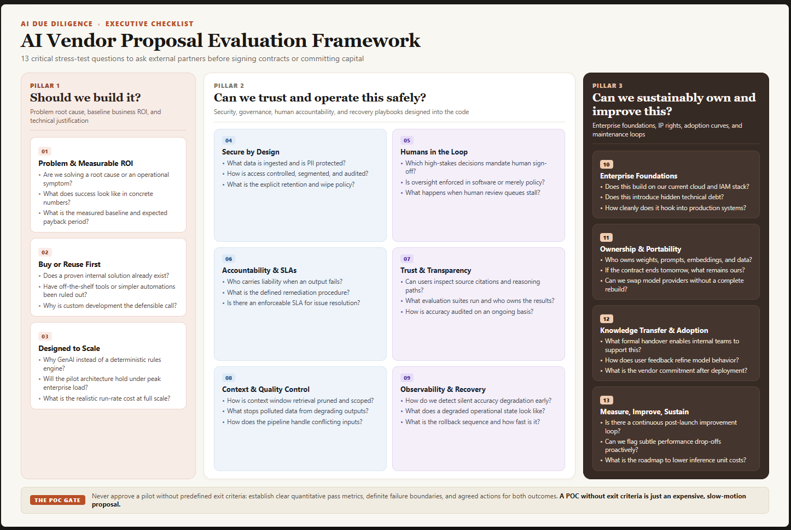

# AI Proposal Advisor

A reusable skill that stress-tests an AI vendor proposal and turns it into a scored assessment, a list of critical blind spots, and a set of clarifying questions you can send straight back to the vendor.

I built this because most teams outside of tech do not have the technical background to review a vendor proposal on their own. We give trusted partners access to internal information, they find a real business problem, and then they jump straight to the solution. Architecture, roadmap, resourcing, done. But the hard questions rarely get asked.

This skill makes those questions routine.

## What it does

You upload a vendor proposal, a RFP response, or a solution deck, and the agent works it against a structured framework of 13 questions across three pillars:

- **Should we build it?** Problem validity, business value, financial return, and technical fit.
- **Can we trust and operate this safely?** Data protection, humans in the loop, accountability, and recovery.
- **Can we sustainably own and improve this?** Enterprise foundations, IP and portability, and long-term improvement.

Each of the 13 dimensions gets scored from 0 to 10. The agent also surfaces the top three blind spots that could derail the project, and it writes 5 to 7 pointed questions you can email back to the vendor.

## How to use it

1. Ask your AI tool to install this skill by giving it the URL of this github repo. Most AI agents and harnesses can setup and install skills from markdown files.
2. Once the Skill is installed, upload a vendor proposal.
3. Ask your agent to review it using the AI Proposal Advisor skill.
4. Read the executive summary, the overall score, the blind spots, and the questions to send back.

## The POC gate

One rule matters more than any other. If a proposal recommends a pilot, the skill checks for clear exit criteria. Defined pass criteria, defined fail criteria, and pre-agreed next steps. A pilot without that is just an expensive, slow-motion proposal.

## A note on timing

Not every question can be answered at proposal stage, and that is okay. Some things only become clear through a pilot. This skill tells you which ones need a pilot and how to define success, and failure, before you start one.

## License

MIT. Use it, fork it, and adapt it to your context. The framework is meant to grow.
